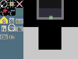

# HAWPS

Half assed wannabe physics simulator.  
The name is the game.  
I just want to have fun writing something dumb.  

# Dev dependencies

`go install golang.org/x/tools/cmd/stringer`  

# Build

`make`  
